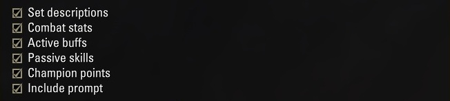

# CDescriptor

A small Elder Scrolls Online addon that exports your character build as structured JSON — ready to paste into an LLM, a spreadsheet, or anywhere you need it.

---

## What it exports

The output always includes:

- **Character** — name, class, race, level, champion point total
- **Skills** — both action bars including ultimate; scribing skills include their active scripts (a/b/c) with name and description
- **Gear** — each slot with item name, set, quality, trait, and enchant

Five additional sections are optional, each controlled by a checkbox:

| Checkbox | Contents |
|---|---|
| Set descriptions | Full bonus text for each equipped set, with piece count |
| Combat stats | Max resources, regen, spell/weapon damage, penetration, resistances |
| Active buffs | All buffs currently applied to your character |
| Passive skills | Learned vs. total passives per skill line |
| Champion points | Slottable and passive CP investments per discipline |

---

## Dynamic Prompt

Enable the **Include Prompt** checkbox to attach a structured LLM prompt above the JSON output. Configure:

- **Language** — the language you want the analysis written in
- **Content type** — PvE (Solo / Dungeons / Trials) or PvP (Cyrodiil / Imperial City / Battlegrounds), with difficulty for group content
- **Role** — Full analysis, DPS, Tank, Healer, or Hybrid

The result is a **ready-to-paste** block:

 **[PROMPT]** + **[JSON]**
 
 one copy action.

---

## Screenshots

---

## Usage

1. Log in to your character.
2. Type `/cdescriptor` or use the keybinding you assigned in **Options → Keybindings → CDescriptor**.
3. Tick the sections you want included.
4. Click **Generate**.
5. Click **Select** — the full output is highlighted. Press **Ctrl+C**.
6. Paste anywhere.

---

## Installation

1. Download and extract the zip.
2. Place the `CDescriptor/` folder inside your `Elder Scrolls Online/live/AddOns/` directory.
3. Enable it in the **AddOns** menu on the character select screen.

No library dependencies required.

---

## Future ideas

Sections that could become additional checkboxes, subject to what the ESO API exposes:

- **PvP rank** — Alliance War rank and points
- **Crafting professions** — skill level per tradeskill
- **Output formats** — YAML or Markdown as alternatives to JSON

Contributions welcome.

---

> Developed with AI assistance (Claude by Anthropic).
