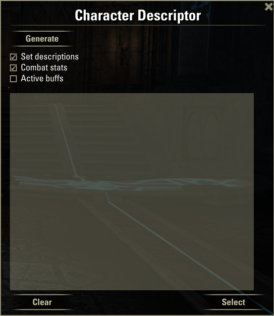
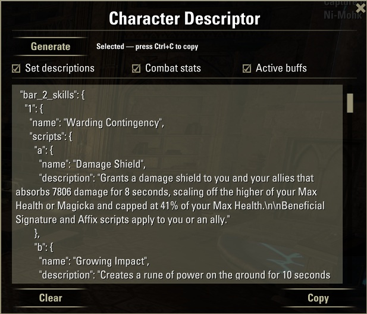

# CDescriptor

A small Elder Scrolls Online addon that exports your character build as JSON, ready to paste into an LLM, a spreadsheet, or wherever you need it.

## What it does

Opens a window with a text box containing a JSON snapshot of your current character:

- **Character** — name, class, race, level, champion points
- **Skills** — both action bars, including ultimate; scribing skills include their active scripts (a/b/c) with descriptions
- **Gear** — each slot with item name, set, quality, trait, and enchant
- **Set descriptions** *(optional)* — the full text of each equipped set bonus
- **Combat stats** *(optional)* — max health/magicka/stamina, regen, spell damage, penetration, resistances, and more
- **Active buffs** *(optional)* — all buffs currently on your character

The three optional sections are toggled with checkboxes in the window.

## Usage
1. Log in to your character.
2. Type `/cdescriptor` or use the keybinding you set in **Options → Keybindings → CDescriptor**.
3. Tick the sections you want, then click **Generate**.
4. Click **Select** — the text is selected. Press **Ctrl+C**.
5. Paste anywhere.

## Installation

1. Download and extract the folder.
2. Place `CDescriptor/` inside your `Elder Scrolls Online/live/AddOns/` directory.
3. Enable it in the **AddOns** menu on the character select screen.

## Notes

- No library dependencies.
- Settings (checkbox states, window position) are saved per account.
- The output is plain JSON — no markup, no metadata.

## Future ideas

Sections that could become additional checkboxes, subject to what the ESO API actually exposes:

- **PVP**: Alliance War rank and points
- **Crafting professions** — skill level in each tradeskill: Blacksmithing, Clothing, Woodworking, Enchanting, Alchemy, etc.
- **Achievements**: feasible but complex, we will see.
- **Output formats**: currently JSON only. _YAML_ and _Markdown_ are natural candidates. _YAML_ is more human-readable I gues, _Markdown_ could render nicely.

Ideas that sound good but need investigation first: mount stats, companion info, housing.

Contributions welcome!
